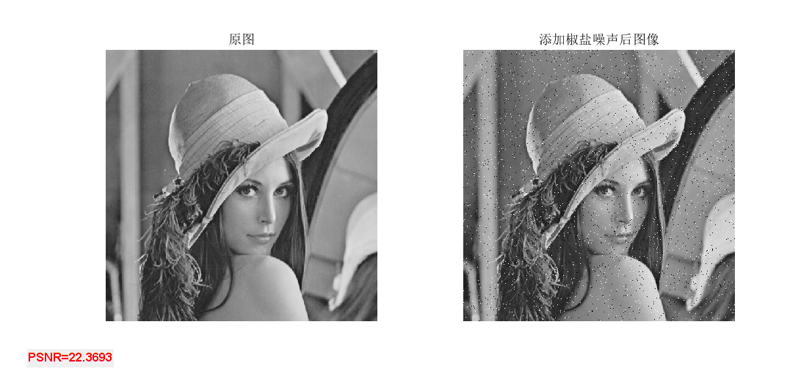
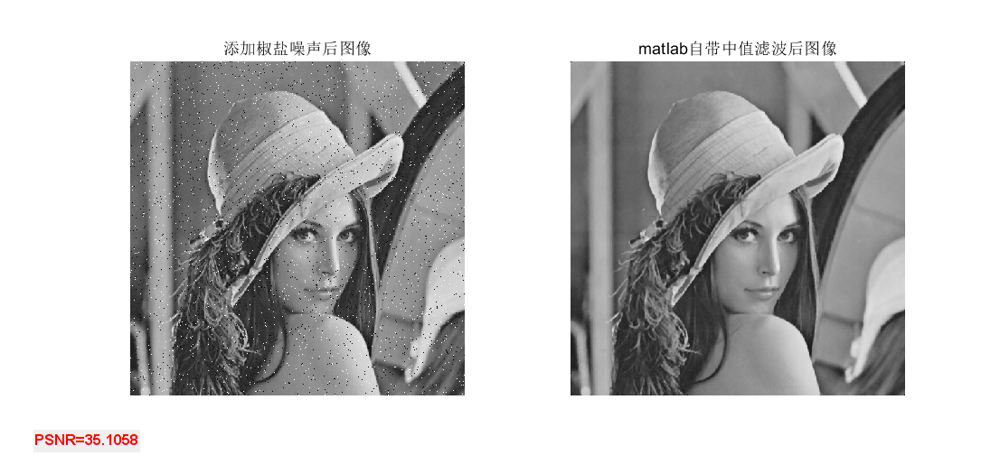

## PSNR

+ `PSNR.m`用来对一幅图像进行高斯滤波

+ `PSNR`是`Peak Signal to Noise Ratio`的缩写，即峰值信噪比，是一种评价图像的客观标准，它具有局限性。`PSNR`值越大，就代表失真越少。

+ 示例：`demo_PSNR.m`

  ```matlab
  img=imread("lena512.bmp");
  img2=imnoise(img,'salt & pepper',0.02); % 添加椒盐噪声
  img3=myfilter(img2,"median",3); % 中值滤波
  img4=medfilt2(img2); % matlab自带中值滤波

  % 计算PSNR
  text1=strcat('PSNR=',char(string(PSNR(img,img2))));
  text2=strcat('PSNR=',char(string(PSNR(img,img3))));
  text3=strcat('PSNR=',char(string(PSNR(img,img4))));

  figure(1)
  subplot(121),imshow(img),title('原图');
  subplot(122),imshow(img2),title('添加椒盐噪声后图像');
  h1=uicontrol('Style','text','String', text1,'Units','normalized');
  set(h1,'fontweight','bold','foregroundcolor','red','FontSize',10);

  figure(2)
  subplot(121),imshow(img2),title('添加椒盐噪声后图像');
  subplot(122),imshow(img3),title('中值滤波后图像');
  h2=uicontrol('Style','text','String', text2,'Units','normalized');
  set(h2,'fontweight','bold','foregroundcolor','red','FontSize',10);

  figure(3)
  subplot(121),imshow(img2),title('添加椒盐噪声后图像');
  subplot(122),imshow(img4),title('matlab自带中值滤波后图像');
  h3=uicontrol('Style','text','String',text3,'Units','normalized');
  set(h3,'fontweight','bold','foregroundcolor','red','FontSize',10);
  ```




