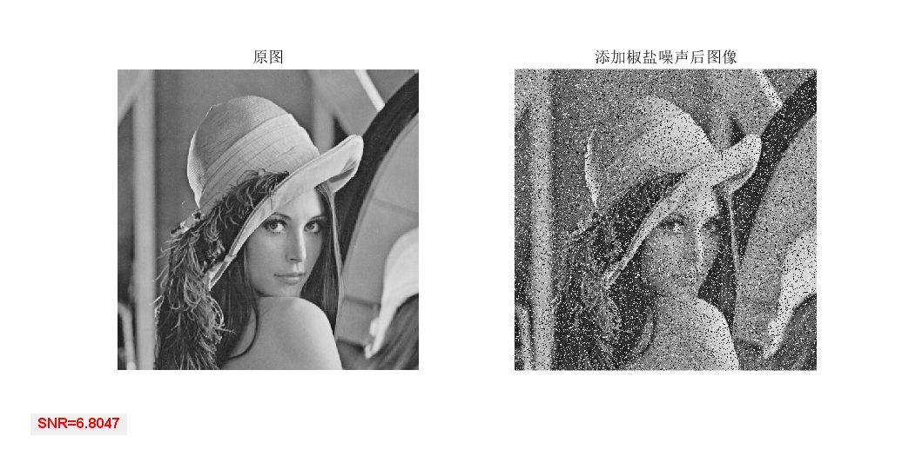

## SNR

+ `SNR.m`用来计算两幅图像的snr

+ 信噪比，英文名称叫做`SNR`或`S/N（SIGNAL-NOISE RATIO)`。是纯误差测度,即原始图像与处理图像之间的数学统计差别,用来评价图像的质量时仅仅考虑与原始图像相似程度的大小,忽视了图像内容对人眼的影响,有时与主观感知有较大差距,不能完整反映出图像的质量,因此该评价方法的使用具有一定局限性。信噪比越高越好。

+ 示例：`demo_SNR.m`

  ```matlab
  img=imread("lena512.bmp");
  img2=imnoise(img,'salt & pepper',0.2); % 添加椒盐噪声
  img3=myfilter(img2,"median",3); % 中值滤波
  img4=medfilt2(img2); % matlab自带中值滤波

  % 计算SNR
  text1=strcat('SNR=',char(string(SNR(img,img2))));
  text2=strcat('SNR=',char(string(SNR(img,img3))));
  text3=strcat('SNR=',char(string(SNR(img,img4))));

  figure(1)
  subplot(121),imshow(img),title('原图');
  subplot(122),imshow(img2),title('添加椒盐噪声后图像');
  h1=uicontrol('Style','text','String', text1,'Units','normalized');
  set(h1,'fontweight','bold','foregroundcolor','red','FontSize',10);

  figure(2)
  subplot(121),imshow(img2),title('添加椒盐噪声后图像');
  subplot(122),imshow(img3),title('中值滤波后图像');
  h2=uicontrol('Style','text','String', text2,'Units','normalized');
  set(h2,'fontweight','bold','foregroundcolor','red','FontSize',10);

  figure(3)
  subplot(121),imshow(img2),title('添加椒盐噪声后图像');
  subplot(122),imshow(img4),title('matlab自带中值滤波后图像');
  h3=uicontrol('Style','text','String',text3,'Units','normalized');
  set(h3,'fontweight','bold','foregroundcolor','red','FontSize',10);
  ```




