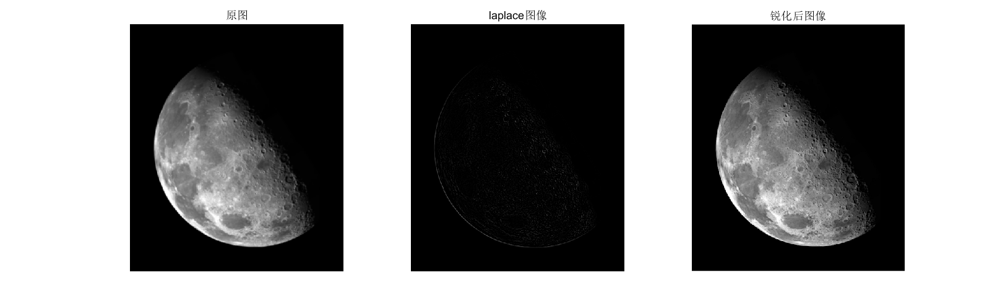

## laplace

+ `laplace.m`用来检测图像边缘并锐化图像

+ `Laplace`算子作为边缘检测之一，和`Sobel`算子一样也是工程数学中常用的一种积分变换，属于空间锐化滤波操作。`laplace`算子定义为梯度（▽f）。对于图像中灰度变化剧烈的区域，`laplace`算子能够实现边缘检测。`laplace`算子利用二次微分特性与峰值间的过零点确定边缘的位置。

+ 示例：`demo_laplace.m`

  ```matlab
  img = imread("Fig0338.tif");
  img2 = laplace("Fig0338.tif");
  img3 = img - img2;
  figure
      subplot(131),imshow(img),title('原图');
      subplot(132),imshow(img2),title('laplace图像');
      subplot(133),imshow(img3),title('锐化后图像');
  ```

