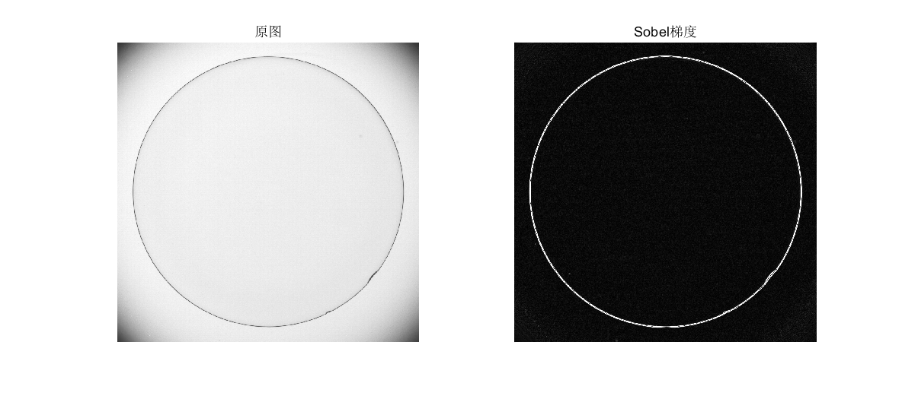

## Sobel

+ `sobel.m`用来检测图像边缘

+ `sobel`算子主要用于获得数字图像的一阶梯度，常见的应用和物理意义是边缘检测。`sobel`算子是把图像中每个像素的上下左右四领域的灰度值加权差，在边缘处达到极值从而检测边缘。不但产生较好的检测效果，而且对噪声具有平滑抑制作用，但是得到的边缘较粗，且可能出现伪边缘。

+ 示例：`demo_sobel.m`

  ```matlab
  img = imread("Fig0342.tif");
  img2 = sobel("Fig0342.tif");
  figure
      subplot(121),imshow(img),title('原图');
      subplot(122),imshow(img2),title('Sobel梯度');
  ```

