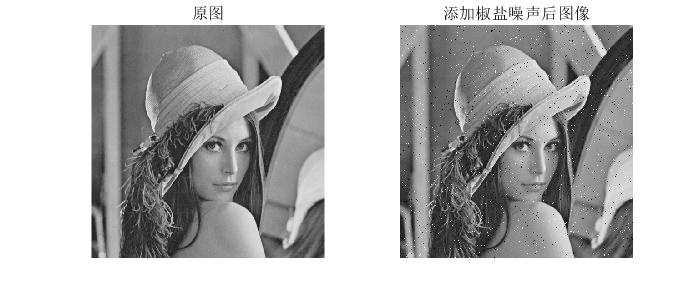
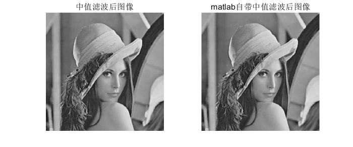

## 中值滤波与均值滤波

+ `myfilter.m`用来对一幅图像进行滤波

  + 可实现均值滤波、中值滤波、最大值滤波、最小值滤波

+ 示例：`demo_myfilter.m`

  ```matlab
  img=imread("lena512.bmp");
  img2=imnoise(img,'salt & pepper',0.02); % 添加椒盐噪声
  img3=myfilter(img2,"median",3); % 中值滤波
  img4=medfilt2(img2);  % matlab自带中值滤波
  img5=myfilter(img,"average",3); % 均值滤波
  img6=imfilter(img2,fspecial('average')); % matlab自带均值滤波

  figure(1)
  subplot(121),imshow(img),title('原图');
  subplot(122),imshow(img2),title('添加椒盐噪声后图像');

  figure(2)
  subplot(121),imshow(img3),title('中值滤波后图像');
  subplot(122),imshow(img4),title('matlab自带中值滤波后图像');

  figure(3)
  subplot(121),imshow(img5),title('均值滤波后图像');
  subplot(122),imshow(img6),title('matlab自带均值滤波后图像');
  ```

  

  

  
