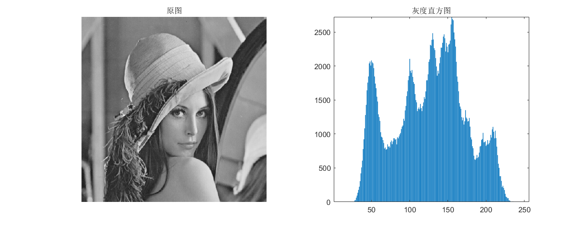

## 灰度直方图

+ `grayhistogram.m`用来绘制一幅图像的灰度直方图

+ 示例：`demo_grayhistogram.m`

  ```matlab
  img = imread("lena512.bmp");

  figure
  subplot(121),imshow(img),title('原图');
  subplot(122),grayhistogram(img),title('灰度直方图');
  ```

  
