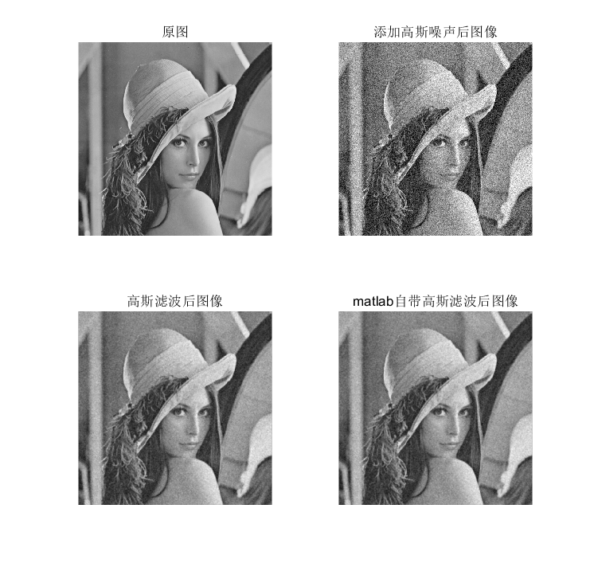

## 高斯滤波

+ `gaosifilter.m`用来对一幅图像进行高斯滤波

+ 示例：`demo_gaosifilter.m`

  ```matlab
  img=imread("lena512.bmp");
  img2=imnoise(img,'gaussian',0.02);  % 添加高斯噪声   
  img3=gaosifilter(img2,5,1);  % 高斯滤波
  img4= imfilter(img2,fspecial('gaussian',[5,5],1));% matlab自带高斯滤波

  figure
  subplot(221),imshow(img),title('原图');
  subplot(222),imshow(img2),title('添加高斯噪声后图像');
  subplot(223),imshow(img3),title('高斯滤波后图像');
  subplot(224),imshow(img4),title('matlab自带高斯滤波后图像');
  ```


